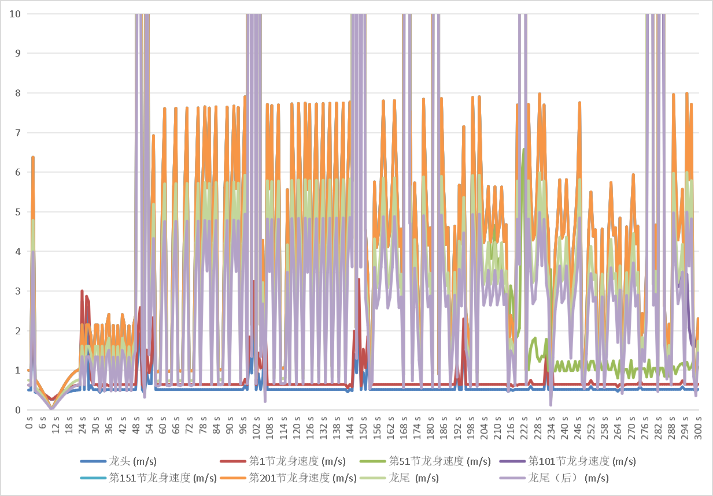
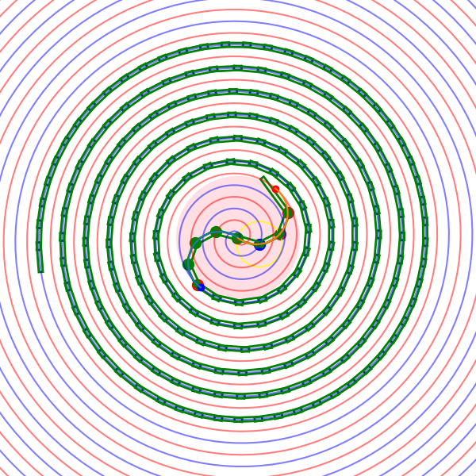

# 问题重述

## 问题背景

"板凳龙"，也称为"盘龙"，是浙江和福建地区的一种传统民俗文化活动。在这一活动中，人们将几十条甚至上百条板凳首尾相连，形成蜿蜒曲折的龙形结构，并在庆典和节日时进行表演。表演时，龙头带领前进，龙身和龙尾随之盘旋，整体呈现出一个圆盘状。如果表演需要较小的面积且行进速度较快，则观赏性会更高。

这些板凳龙具体由较长的龙头板凳、多个较短的龙身板凳和龙尾板凳组成。例如，一条板凳龙由223节板凳组成，第一节为龙头，后面221节为龙身，最后一节为龙尾。龙头板凳长
$341cm$ ，龙身和龙尾板凳均长 $220cm$ ，所有板凳的宽度均为 $30cm$
。每节板凳有两个孔，孔径为 $5.5cm$ ，孔的中心距离最近的板凳头 $27.5cm$
。这些板凳通过把手连接在一起，形成整体的龙形结构。

在上述背景下，如何在舞龙过程中优化路径，使得盘龙所需的面积最小、行进速度最快，是提高表演观赏性的重要手段。

## 问题要求

### 问题一 {#问题一 .unnumbered}

龙头以 $v=1 m/s$ 的速度沿螺距 $p=55 cm$
的等距螺线顺时针盘入，初始时龙头位于螺线第16圈的A点。要求建立一个数学模型，以计算从初始时刻到300秒为止，每秒整个舞龙队的位置和速度，包括龙头、龙身和龙尾各前把手及龙尾后把手中心的位置和速度。结果需保存于文件result1.xlsx。在论文中，详细描述在0秒、60秒、120秒、180秒、240秒、300秒时，特定节点的位置和速度。这些节点包括龙头、龙头后面第1、51、101、151、201节龙身前把手和龙尾后把手。

### 问题二 {#问题二 .unnumbered}

舞龙队按问题一的设定进行螺线盘入，需要确定舞龙队盘入终止的时刻，即舞龙队不能再继续盘入的时间。给出此时舞龙队的位置和速度并将结果存放到文件result2.xlsx中，同时在论文中详细描述此时特定节点的具体位置和速度。

### 问题三 {#问题三 .unnumbered}

舞龙队由顺时针盘入调头切换为逆时针盘出，需要一定的调头空间。假设调头空间为以螺线中心为圆心，直径为9米的圆形区域。要求确定使龙头前把手能够沿着相应螺线盘入到调头空间边界的最小螺距。

### 问题四 {#问题四 .unnumbered}

盘入螺线的螺距为1.7米，盘出螺线与盘入螺线关于螺线中心呈中心对称，舞龙队在预计的调头空间内完成调头。调头路径由两段相切的圆弧连接而成，形成S形曲线。前半段圆弧的半径为后半段的两倍，且与盘入、盘出螺线均相切。

确定是否可以调整圆弧，保持各部分相切，使调头曲线变短。以调头开始时刻为零时刻，给出从-100秒到100秒每秒舞龙队的位置和速度。将结果保存到文件result4.xlsx中。在论文中详细描述特定时刻的具体位置和速度。

### 问题五 {#问题五 .unnumbered}

根据问题四设定的路径行进，龙头行进速度保持不变，要求确定龙头的最大行进速度，使得舞龙队各把手的速度均不超过2
m/s。

# 问题分析

## 问题一的分析

在问题一中，需要建立一个数学模型以计算舞龙队从初始时刻到300秒期间的每秒位置和速度。首先，确定初始条件：龙头位置位于螺线第16圈的A点，龙头始终以1
m/s的速度沿螺距为55
cm的等距螺线顺时针移动。螺线的几何特性可以通过极坐标形式描述龙头的运动路径。

基于盘龙运动起点这一特解，可以联立微分方程计算 $\theta$
随时间变化的方程。因此，在确定螺线方程后，由于龙头速度大小不变，可以计算出每个时刻龙头把手的位置。通过等式约束，相邻两个把手的连线长度保持恒定。通过缩小搜索范围并确定约束条件，优化计算每个后续点的位置，从而迭代出后续把手中心点的坐标。最后，通过定义
$\Delta t$ ，计算 $\Delta v = \frac{ds}{dt}$
，从而得到各个点在任意时刻的速度。通过模型计算龙头、龙身、龙尾各前把手及龙尾后把手中心在每秒的位置和速度并将螺旋线的几何参数转换成每个把手中心的实际位置。

## 问题二的分析

问题二要求按照问题一中设定的螺线盘入路径，这一问题实际上是问题一的延伸，找到舞龙队无法继续盘入时的终止时刻。在舞龙队的盘入过程中，需要考虑可能发生的碰撞，这将导致队伍无法继续盘入。在这一过程中，需要确保舞龙队在进入更深的螺线时，相邻板凳不会发生碰撞。因此，必须考虑舞龙队中各节的宽度和空间布局。

具体而言，继续使用问题一中的模型，但需要增加一个碰撞检测机制。在每一步迭代中，检查相邻板凳之间的距离。如果发现任意两节板凳在某一时刻发生重叠，则认为发生了碰撞，此时刻即为盘入的终止时刻。然后可以依据问题一的解法，求出此时各把手的位置和速度。

## 问题三的分析

问题三要求从顺时针盘入到逆时针盘出，需要一定的调头空间。这一过程中，需要确定一个最小螺距，使得龙头前把手在顺时针盘入时能够到达设定的调头空间边界。调头空间设定为以螺线中心为圆心、直径为9米的圆形区域。
可以利用二分法调整螺距取值范围，找到恰好使舞龙队运动到螺线与调头空间相切的点上的最小螺距值，确保不发生碰撞。首先计算舞龙队从顺时针螺线移动到调头空间的路径。结合极坐标几何和调头空间的约束条件，通过逐步缩小螺距值的方法迭代逼近最小螺距值。

## 问题四的分析

在问题四中，舞龙队的盘入螺线螺距为1.7米，设定的盘出螺线与盘入螺线关于螺线中心呈中心对称状态，舞龙队需要在一个具体的调头空间内完成调头。调头路径由两段圆弧相切连接而成，为S形曲线。前半段圆弧的半径为后半段的两倍，并与盘入、盘出螺线均相切。通过数学模型计算是否可以调整圆弧的半径，同时保持曲线的相切约束，从而缩短调头曲线的长度。计算从-100秒到100秒，每秒龙头和其他节点的位置和速度。

## 问题五的分析

问题五要求在沿问题四设定的路径行进时，确定龙头的最大行进速度，使舞龙队各把手的速度均不超过2
m/s。首先，舞龙队的行进路径和速度已经在问题四中得到确定，接下来需要进行进一步的动态分析，通过设置不同的龙头行进速度进行实验。

在保证各把手中心速度不超过2
m/s的前提下，首先假设一个初始最大速度，然后根据运动方程和约束条件，逐步调整龙头的行进速度，直到舞龙队的任意一节板凳速度刚好达到2
m/s。通过对动态模型进行多次迭代和优化，得出龙头的最大行进速度。

# 建模假设

在解决问题前，我们做出以下假设：

1.  假设每节板凳都是刚性的，即它们在运动过程中不会发生形变。无外界干扰，不考虑风力、摩擦力、地面不平等因素对板凳龙运动的影响。不考虑惯性力和舞龙人员体力等内部因素的影响。

2.  假设每节板凳的质量在板凳上均匀分布。所有板凳在水平面上绝对平整，无弯折和变形。

3.  假设板凳龙各参数的规划仅考虑速度和螺距等主要因素，不考虑实际操作准确度和难度对参数确定及路径的影响。

4.  假设板凳龙的每节板凳能够在任意合理范围内顺畅移动，不会发生摩擦或挤压等问题。板凳龙的运动是连续且平滑的，没有突然停顿或剧烈冲击。

5.  假设碰撞情况只考虑龙头与龙身的碰撞，由于龙头长度比龙身长，因此龙头能通过的路径，龙身同样可以通过。

# 符号说明

本文中使用的符号说明如表[\[tab:symbol\]](#tab:symbol){reference-type="ref"
reference="tab:symbol"}所示。

# 问题一、二模型的建立与求解

## 基于阿基米德螺线的盘龙动力学模型

### 阿基米德螺线运动

阿基米德螺线，又称为"等速螺线"，其运动特性描述为：一点 $p$ 沿着射线 $op$
以匀速运动，同时该射线 $op$ 以等角速度绕 $o$ 点旋转， $p$
的轨迹即为阿基米德螺线。

<figure id="fig:spiral">

<figcaption>阿基米德螺线</figcaption>
</figure>

在极坐标系中，阿基米德螺线的方程表示为：

$$r = \frac{b_c}{2\pi}\theta + a$$

其中： - $\theta$ 为极角， - $r$ 为极径， - $b_c$ 为两臂之间的距离， -
$a$ 为初始极径。

为了进一步分析阿基米德螺线上的运动，考虑极坐标系中任意点的速度分解。任意点
$p$ 的速度 $v$ 可以表示为：

$$v = \sqrt{V_{\theta}^2 + V_r^2}$$

其中： - $V_{\theta}$ 为角速度分量， - $V_r$ 为径向速度分量。

角速度分量 $V_{\theta}$ 由点 $p$
的旋转角速度和与极点的距离决定。假设射线 $op$ 以常定角速度 $\omega$
旋转，则角速度分量为：

$$V_{\theta} = \omega r = \omega \left( \frac{b_c}{2\pi}\theta + a \right)$$

由于点 $p$ 沿着极径方向以恒定速度 $v_r$
匀速运动，从阿基米德螺线的定义可知：

$$V_r = \frac{dr}{dt} = \frac{d}{dt} \left( \frac{b_c}{2\pi} \theta + a \right) = \frac{b_c}{2\pi} \frac{d\theta}{dt}$$

显然， $\frac{d\theta}{dt} = \omega$ ，因此径向速度分量为：

$$V_r = \frac{b_c}{2\pi} \omega$$

将角速度分量和径向速度分量代入总速度公式中：

$$v = \sqrt{V_{\theta}^2 + V_r^2}$$

代入具体表达式：

$$V_{\theta} = \omega \left( \frac{b_c}{2\pi}\theta + a \right)$$

$$V_r = \frac{b_c}{2\pi} \omega$$

从而总速度为：

$$v = \sqrt{\left[\omega \left( \frac{b_c}{2\pi}\theta + a \right) \right]^2 + \left( \frac{b_c}{2\pi} \omega \right)^2}$$

展开并简化上式：

$$v = \sqrt{\omega^2 \left[ \left( \frac{b_c}{2\pi}\theta + a \right)^2 + \left( \frac{b_c}{2\pi} \right)^2 \right]}$$

$$v = \omega \sqrt{\left( \frac{b_c}{2\pi}\theta + a \right)^2 + \left( \frac{b_c}{2\pi} \right)^2}$$

以上就是阿基米德螺线上任意一点的速度表达式。通过以上公式，可以充分描述阿基米德螺线上的动力学模型。

<figure id="fig:spiral_velocity">

<figcaption>阿基米德螺线及速度分解</figcaption>
</figure>

与此同时，其笛卡尔坐标方程可表示为：

$$\begin{cases}
        v_{x} = \left(\frac{b_{c}}{2\pi}\cos\theta - r\sin\theta \right)\omega \\
        v_{y} = \left(\frac{b_{c}}{2\pi}\sin\theta + r\cos\theta \right)\omega
    \end{cases}$$

其中：

$$\begin{cases}
        x = r\cos\theta \\
        y = r\sin\theta
    \end{cases}$$

在笛卡尔坐标系下，对合速度进行分解可得到速度分量方程：

$$\begin{cases}
        v_{x} = \left(\frac{b_{c}}{2\pi}\cos\theta - r\sin\theta \right)\omega \\
        v_{y} = \left(\frac{b_{c}}{2\pi}\sin\theta + r\cos\theta \right)\omega
    \end{cases}$$

根据阿基米德螺线的定义，角速度不变，而线速度可变，因此有：

$$\omega = \frac{d\theta}{dt}$$

### 盘龙运动姿态的确定

**盘龙运动的速度特征**

盘龙，又称"板凳龙"，由223节板凳组成。其形状如图[3](#fig:dragon_bench){reference-type="ref"
reference="fig:dragon_bench"}所示

<figure id="fig:dragon_bench">

<figcaption>完整的龙形板凳结构</figcaption>
</figure>

舞龙队沿螺距为55cm的等距螺线顺时针从A点盘入，各把手中心均在螺线上，且以1m/s的速度向内盘入。由阿基米德螺线的极坐标方程，令a=0,则盘龙的运动方程可表示为
$r=b \cdot \theta$ , $\theta \in [0, 32 \pi]$
。为了更好的研究盘龙运动的状态，我们将前后把手中心走过的弧长D1近似于前后把手中心的距离(即板长)。将把手中
$b=\frac{b_{c}}{2\pi}$ ,心进行速度矢量分解，把手中心受到与螺线相切的速度
$v_{\theta}$ 和与平行极距的速度 $v_{r}$
。其运动时的示意图大概如图[4](#fig:dragon_motion){reference-type="ref"
reference="fig:dragon_motion"}所示。

<figure id="fig:dragon_motion">

<figcaption>盘龙运动示意图</figcaption>
</figure>

**盘龙运动的运动路径**

在研究盘龙的运动时，我们可以考虑盘龙走过的路径随时间的变化关系。根据阿基米德螺线的特性，盘龙走过的路径变化量与极角的变化量有关。设时间
$t$ 为自变量，可以表示极角和极距随时间的变化关系：
$\theta(t) = \omega t$ 和 $r(t) = b\theta(t) = b\omega t$。

设阿基米德螺线的弧长为 $s$。根据阿基米德螺线的弧长公式：

$$L = \int_{0}^{\Delta\theta} \sqrt{\left( \frac{dr}{d\theta} \right)^2 + r^2} d\theta,$$

在单位时间内，龙头走过的路径可近似表示为：

$$\frac{ds}{dt} = \sqrt{\left( \frac{dr}{d\theta} \right)^2 + r^2} \frac{d\theta}{dt}.$$

又因为 $\frac{dr}{d\theta} = b$，所以：

$$ds = \sqrt{b^2 \theta^2 + b^2} d\theta,$$ $$\frac{ds}{dt} = b\sqrt{\theta^2 + 1} \frac{d\theta}{dt} = v.$$

龙头以1 m/s的速度盘入，螺距 $b = 55$
cm。我们可以得到极角与时间的微分方程，给定初始起点
$A(16 \times 2\pi, 0)$。于是得：

$$\begin{cases}
        \frac{d\theta}{dt} = -\frac{1}{b\sqrt{\theta^2 + 1}}, \\
        \theta(0) = 32\pi.
    \end{cases}$$

由于这个微分方程没有解析解，因此可以通过数值模拟来计算在未来时间内极角的变化。

**盘龙运动的位置确定**

龙头前把手的速度始终保持在1
m/s，沿着螺线顺时针前进。结合螺线的弧长公式，可以确定龙头前把手在螺线上各个时间点的位置。考虑到前把手和后把手之间的距离为定长，可以在直角坐标系中计算两点之间的欧氏距离，以找到下一个点的坐标位置。数学公式表示如下：

$$\label{eq:euclidean_distance}
    D_i = \sqrt{(x_i - x_{i+1})^2 + (y_i - y_{i+1})^2} \quad (i = 0, 1, 2, \dots)$$

其中 $(x_i, y_i)$ 表示第 (i)
个前把手的位置。以龙头前把手的坐标为圆心，板长为半径，与螺线相交可以得到多组数值解。

为了优化目标问题，可以通过龙头前把手所在的螺线确定后一个前把手位置的上下界，从而缩小搜索范围。如下图所示：搜索范围缩小到
\[当前前把手所在螺线圈数 - 1\] 到 \[当前前把手所在螺线圈数 +
1\]。随着舞龙的盘入，把手的极角也会随之变小，且前一个把手的极角一定小于后一个把手的极角。加入这一约束条件后，可以遍历出每组数值解的极角，并以极角的约束条件
$\min(\theta_{i} - \theta), \quad i = 1, 2, 3, \dots$，求得目标函数最小值对应的
$\theta_{i}$。$(x_i, y_i)$
即为后一个点的位置。依次遍历所有点，得到所有把手在螺线上的位置。

### 问题一模型求解

**把手中心的位置求解**

为了求解把手中心的位置，我们采用逐步搜索的方法。首先，需要确定龙头前把手的位置。这可以通过方程[\[eq:euclidean_distance\]](#eq:euclidean_distance){reference-type="ref"
reference="eq:euclidean_distance"}实现，将连续函数离散化以得到多组数值解。这些数值解提供了初步的位置信息。然而，仅这些初步位置是不够的。为了确保找到的坐标符合所有约束条件，还需进一步优化这些数值解。具体来说，通过调整这些坐标的上下界，可以逐步缩小搜索范围，最终找到符合所有约束条件的最优坐标。这一过程需要综合考虑多个参数和约束条件，以确保求解结果的准确性和可靠性。表[1](#tab:hand_center){reference-type="ref"
reference="tab:hand_center"}为各个时刻前把手和后把手的坐标位置：

::: {#tab:hand_center}
      **index**       **0 s**    **60 s**   **120 s**   **180 s**   **240 s**   **300 s**
  ------------------ ---------- ---------- ----------- ----------- ----------- -----------
       龙头x(m)       8.733366   5.074563    -4.8182    -2.15602    1.845406    4.694857
       龙头y(m)       -0.99667   -6.40442   -5.74948    6.413177    -5.64623    1.660199
    第1节龙身x (m)      8.8      7.045679   -2.24738    -4.64012    4.313917    3.031728
    第1节龙身y (m)    1.862551   -4.20079   -7.19308    4.975221    -4.14564    4.014775
   第51节龙身x (m)      8.8        8.8      -4.29198    3.820438     5.26149    -6.18594
   第51节龙身y (m)    84.36255   26.51779   7.260526    6.791878    -4.74601    1.233728
   第101节龙身x (m)     8.8        8.8         8.8      2.769438     -6.1328    -6.05362
   第101节龙身y (m)   166.8626   109.0178   47.61638    -8.23783    -5.19367     4.20686
   第151节龙身x (m)     8.8        8.8         8.8         8.8         8.8      7.670461
   第151节龙身y (m)   249.3626   191.5178   130.1164    71.35854    11.06555    3.128418
   第201节龙身x (m)     8.8        8.8         8.8         8.8         8.8         8.8
   第201节龙身y (m)   331.8626   274.0178   212.6164    153.8585    93.56555    33.75277
     龙尾(后)x(m)       8.8        8.8         8.8         8.8         8.8         8.8
     龙尾(后)y(m)     366.5126   308.6678   247.2664    188.5085    128.2155    68.40277

  : 把手中心的位置
:::

**把手中心的速度求解**

在求解把手中心速度时，首先定义一个时间增量
$\Delta t = 1$。这个时间增量将用于对每个把手中心进行搜索。具体步骤如下：首先，计算同一个点在相邻
$\Delta t$
时间内经过的弧长。此过程可通过积分实现。接下来，通过已知坐标计算相邻两点之间的欧氏距离，即其实际的运动路径长度。在确定了两个位置间的距离后，可以利用以下公式计算当前把手中心的速度：

$$\Delta v = \frac{ds}{dt}$$

其中，$ds$ 是在时间 $\Delta t$ 内把手中心所经过的距离，$dt$ 则是时间增量
$\Delta t$。通过对每个时间增量进行计算，可以得到把手中心在整个运动过程中不同位置的速度。下表为各个时刻前把手和后把手的速度大小：

**求解结果及分析**

<figure>

<figcaption>盘龙可视化结果</figcaption>
</figure>

{width="\\textwidth"}

为了验证速度图像的正确性，通过查阅文献，当物体做螺线运动时，其曲率半径、法向速度以及合速度满足
$\kappa=\frac{v^2}{a_n}$。等距螺线的曲率半径为

$$\kappa = \frac{r^2 + 2b^2}{(r^2 + b^2)^{3/2}}$$

对其求导得

$$\frac{d\kappa}{dr} = \frac{2r(b^2 + r^2)^{1.5} - 3r(2b^2 + r^2)}{(b^2 + r^2)^{2.5}}$$

结果恒小于零，因此曲率半径随着极径 $r$
的减小而逐渐增大。由于盘龙在运动过程中法向速度保持不变，因此可知合速度
$v$ 随着盘龙的盘入而增大。

## 物理仿真中运动停止条件的判断

### 碰撞检测的临界条件

在盘龙运动过程中，随着盘入时间的增加，盘龙所占用的空间逐渐缩小，剩余可盘入的空间也随之减小，导致盘龙越容易发生"碰撞现象"，从而无法继续盘入。基于预定的盘入路径，定义投影碰撞函数：对于任意两个相邻点，取其连线段的中点为中心，向四周扩展生成一定大小的矩形。若任意两个矩形之间出现交集，则表示盘龙运动的路径发生了碰撞，运动将立即停止。

### 问题二的求解

通过物理仿真，我们计算出在**t=410s**时，龙头与龙身相撞。表[2](#tab:collision){reference-type="ref"
reference="tab:collision"}表示舞龙队不能再继续盘入时各把手的位置和速度：

::: {#tab:collision}
    **index**    **横坐标x (m)**   **纵坐标y (m)**   **速度 (m/s)**
  ------------- ----------------- ----------------- ----------------
      龙头          -1.67709          1.723837          0.475562
    第1节龙身       -2.26608          -1.08912          0.961758
   第51节龙身       -1.68247          4.249558          0.858562
   第101节龙身      2.449599          -5.42197          0.744062
   第151节龙身      3.501215          -6.12829          0.660453
   第201节龙身      -7.32672          -3.24076          0.749875
    龙尾(后)        -1.82731          8.205682          0.786046

  : 舞龙队不能再继续盘入时各把手的位置和速度
:::

# 问题三模型的建立与求解

## 调头空间的边界约束

当舞龙队进行盘龙表演时，龙头需要先以顺时针方向盘入调头空间，然后再切换为逆时针方向盘出。这个过程不仅需要队员的高度协作，还涉及到复杂的轨迹规划。为了确保龙头前把手能够沿着阿基米德螺线顺利进入调头空间的边界，我们必须首先确定一个关键参数------最小螺距。

要做到这一点，我们需要明确阿基米德螺线的相关方程以及调头空间的具体条件。调头空间定义为一个以螺线中心为圆心，直径为9米的圆形区域。在龙头盘入调头空间的过程中，我们必须找到合适的极角
$\theta$ 和螺距 $p$，这样才能确保运动轨迹的准确性和安全性。

根据上文的描述，螺线的运动方程为 $r = p\theta$，其中 $r$
表示极径，$\theta$ 表示极角，而螺距 $p$
则是需要计算的特征变量。这个方程不仅帮助我们清晰描述龙头的移动轨迹，同时也为确定最小螺距提供了理论依据。

通过对螺线方程和调头空间条件的详细分析，我们能够准确计算出最小螺距。这一计算至关重要，因为它确保舞龙表演中的龙头能够顺利进出调头空间，避免发生任何碰撞或错误动作。这样，不仅能提升表演的整体效果，还能增强观众的视觉体验，使表演更加流畅和精彩。

## 基于二分搜索的碰撞检测模型

基于对问题一和问题二的物理仿真研究，当螺距 $b = 55$
厘米时，盘龙运动达到盘入的终止时刻。此时，观察发现，龙头前把手的极径小于调头空间的半径。这表明龙头可以顺利进入调头空间的边界，但为了进一步优化，我们需要找到最小的螺距。

在利用二分法查找最小螺距的过程中，需要设定上界约束和下界约束。首先，螺距的上界约束可以确定为
$p_{max} = 55$
厘米。这是因为在此螺距下，龙头前把手的极径已经符合调头空间的半径要求。

接下来，我们需要确定螺距的下界约束。螺线的螺距必须大于相邻两节板凳宽度中心之间的最小距离。当螺距小于或等于这个最小距离时，板凳之间必然发生碰撞，导致龙头无法顺利通过。因此，这个最小距离确定了螺距的下界约束。

因此，螺距的搜索范围可以初始化为 \[下界约束,
上界约束\]。在这些约束条件下，我们可以通过二分搜索法进行计算，以找到最小螺距。具体来说，二分法是一种高效的搜索算法，通过不断将搜索范围减半，可以在较短的时间内收敛到最优解。每次迭代中，我们计算当前螺距值对应的龙头前把手的极径，并判断其是否位于调头空间的允许范围内。如果满足条件，则更新上界约束；否则，更新下界约束。经过多次迭代，最终可以准确找到满足所有约束条件的最小螺距。

这一最小螺距是至关重要的参数，它不仅确保了龙头能够顺利进入调头空间，而且还最大限度地优化了轨迹规划，使得舞龙表演更加流畅和安全。

## 问题三的求解

### 二分法查找最小螺距的区间

1.  初始化时间区间：首先确定时间区间的起点和终点。这两个值表示我们感兴趣的螺距范围。例如，可以设定为30cm，为55cm，这个范围涵盖了我们预期的可能的最小螺距。$p_{start} = 30cm$
    ，$p_{end} = 55 cm$。

2.  定义判断条件：设置一个小的正数 $\epsilon$，作为停止条件。$\epsilon$
    通常取一个非常小的值，用以决定迭代何时停止。例如，可以设定
    $\epsilon = 0.01$ cm，当两端点的差小于 $\epsilon$
    时，我们认为已经找到了足够精确的最小螺距。

3.  进入循环：在每次迭代中，首先判断当前区间的长度是否小于
    $\epsilon$。如果小于
    $\epsilon$，则停止迭代，并确定最小螺距。否则，继续以下步骤。

4.  计算中点：计算当前区间的中点螺距
    $p_{mid}$。公式为：$p_{mid} = \frac{p_{start} + p_{end}}{2}$。这个中点表示当前区间的平均值，是我们接下来要测试的螺距值。

5.  碰撞检测：调用碰撞检测函数 Hit($p_{mid}$)。如果函数返回
    True，表示在螺距为 $p_{mid}$
    时发生了碰撞，在这种情况下，我们将区间更新为
    $[p_{start}, p_{mid}]$，因为最小螺距在此范围内。如果函数返回
    False，表示在螺距为 $p_{mid}$ 时没有发生碰撞，此时，我们将区间更新为
    $[p_{mid}, p_{end}]$，因为最小螺距应在这个新范围内。

6.  重复以上步骤：继续迭代步骤3至5，不断缩小区间，直到区间长度小于
    $\epsilon$，确定最小螺距。最终得到的最小螺距为**45.03cm**。

通过以上算法步骤，我们可以有效地找到最小螺距。下面是流程图展示：

::: algorithm
初始化时间区间 $[p_{\text{start}}, p_{\text{end}}]$ 设置停止条件
$\epsilon$

$p_{\text{min}} = \frac{p_{\text{start}} + p_{\text{end}}}{2}$

$p_{\text{min}}$
:::

# 问题四模型的建立与求解

{width="80%"}

对于问题四，我们研究了一条过原点且斜率为 $k$
的直线，这条直线与正反等距螺线相交，并基于此定义一个比掉头空间更小的圆形区域，称为范围圆。在范围圆内，有两条相切的圆弧，它们形成一个闭合路径，即掉头路径。根据相关数学公式，掉头路径的长度与圆弧半径直接相关。

为了进一步分析和简化问题，我们可以将掉头路径简化为两条半径相等的圆弧。这种简化使得路径长度与半径直接相关。具体来说，路径长度的下界取决于角度
$\theta$，上界则是角度 $\theta$
加上180度。这是因为当角度大于180度时，路径将绕多一圈，导致路径长度增加。

直线斜率 $k$ 与范围圆交点

给定直线的方程为： $$y = kx$$

范围圆的方程为： $$x^2 + y^2 = R^2$$

将直线方程代入圆的方程，得到：

$$x^2 + (kx)^2 = R^2$$

$$x^2(
    1 + k^2) = R^2$$ $$x^2 = \frac{R^2}{1 + k^2}$$

$$x = \pm \frac{R}{\sqrt{1 + k^2}}$$

对应的 $y$ 坐标为：

$$y = kx = \pm \frac{kR}{\sqrt{1 + k^2}}$$

两圆弧相切点的计算 假设两条相切的圆弧的半径为
$r$，它们相切点的角度范围在 $[0, 180^\circ]$ 之间。

圆弧一的方程可以表示为： $$$$

圆弧二的方程为：
$$(x + r \cos \theta')^2 + (y + r \sin \theta')^2 = r^2$$

两条圆弧相切，使得它们在范围圆内形成闭合路径。

掉头路径长度与圆弧半径 $r$ 的关系

两圆弧的总长度为： $$L = 2\pi r \cdot \frac{\theta}{360^\circ}$$

如果 $\theta$
超过180度，即$\theta' = \theta + 180^\circ$，那么路径长度增加：

$$L = 2\pi r \cdot \left(\frac{\theta + 180^\circ}{360^\circ}\right)$$

通过上述转换，我们将掉头路径长度与圆弧半径之间的关系转化为与参数 $k$
之间的关系。这种转换不仅简化了计算，也使得对路径长度的分析更加直观和便捷。

      **index**        **-100s**       **-50s**        **0s**        **50s**        **100s**
  ------------------ -------------- -------------- -------------- -------------- --------------
    第1节龙身x (m)    -12.23247519   2.008116694    10.66519022    1.961372768    1.026786949
    第1节龙身y (m)    5.669763188    -12.20502448   3.177028607    9.520080381    7.974521291
   第51节龙身x (m)    -5.541577597   -0.369633705    5.79792788    -10.61704856   -5.233861749
   第51节龙身y (m)    13.91465899    -14.01299051   11.69179656    5.100871452    -9.083607116
   第101节龙身x (m)   6.091177471    -10.95545627   13.49274318    -13.44599571   3.644699596
   第101节龙身y (m)    15.3049478    -10.98299463   5.455608453    1.787179388    -11.85820642
   第151节龙身x (m)   17.65385767    -17.00072113   14.94227067    -9.479486237   1.082926108
   第151节龙身y (m)   -2.381196293   -0.491156948   -5.856354798   11.70126147    -14.00407235
   第201节龙身x (m)   -14.78735985   5.285716219    5.394798559    1.271543886    -9.779173798
   第201节龙身y (m)   -11.74084506   17.41058264    -16.65794529   16.50529077    -12.07832602
    龙尾（后）x(m)    13.28724675    -18.24219817   16.54044534    -13.43571874   16.12995546
    龙尾（后）y(m)    -14.03923613   3.848558414    6.993695666    -10.71006844   1.119312451

  : 问题四各个时刻前把手和后把手的位置表

         **index**          **-100s**     **-50s**       **0s**        **50s**      **100s**
  ----------------------- ------------- ------------- ------------- ------------- -------------
        龙头 (m/s)         0.514422673   0.514858791   0.515337222   0.515865296   0.51628182
   第51节龙身速度 (m/s)    1.086806344   1.089455623   1.092363633   1.095575455   1.09869349
   第101节龙身速度 (m/s)   1.136515958   1.140689328   1.145270759   1.150331419   1.155506659
   第151节龙身速度 (m/s)   1.186225839   1.191923332   1.19817822    1.205087763   1.212320262
   第201节龙身速度 (m/s)   1.66045758    1.243157597   1.251085974   1.259844438   1.269134241
     龙尾（后） (m/s)      1.017406586   0.787540598   0.795486393   0.801434225   0.807767543

  : 问题四各个时刻前把手和后把手的速度表

# 问题五模型的建立与求解

## 建立龙头最大速度的单目标优化模型

舞龙运动路径沿问题四设定的路径移动，要求计算龙头的最大速度，同时确保每个把手的速度不超过2
m/s。我们将此条件视为问题的一个约束条件。

根据题目描述的条件，建立一个龙头运动速度的单目标优化模型，其目标函数为：

$$\text{max} \ v_{\text{dragon}}$$

其中，$v_{\text{dragon}}$
表示龙头在运动过程中的速度。关于约束条件，需要考虑以下两点：

1.  每个把手处的速度不超过2 m/s，即
    $$v_{i} \leq 2 \ \text{对于} \ i = 1, 2, \dots, n$$

2.  前后节点的速度可以通过单位时间内的路径递推求出，记为
    $$\Delta v = v_{i} - v_{i+1}$$ 其中， $$\Delta v = \frac{ds_i}{dt}$$

与问题一的解法相同，优化函数为：

$$\begin{aligned}
        \text{max} \quad & v_{\text{dragon}} = v_n + \sum_{i=1}^{n} \frac{ds_i}{dt} \\
        s.t. \quad       & v_{i} \leq 2 \quad \text{对于所有} \ i = 1, 2, \ldots, n     \\
                         & v_{i} \geq 0 \quad \text{对于所有} \ i = 1, 2, \ldots, n
    \end{aligned}$$

## 模型的求解

假设路径可以用一个函数表示，比如
$f(x)$，但实际情况下，该题目的S形路径并没有具体的解析式。所以需要离散化S形路径。因此，我们将路径离散成一系列的点，可以表示为
$(x_i, y_i)$，这些点表示龙头前把手在各个时刻的位置。具体操作上，可以通过一个算法以一定的步长沿着路径取样生成点序列
$(x_1, y_1), (x_2, y_2), \ldots, (x_n, y_n)$。

对于每一对相邻点 $(x_i, y_i)$ 和 $(x_{i+1}, y_{i+1})$，它们之间的距离
$d_i$ 可以使用欧几里得距离公式计算：

$$d_i = \sqrt{(x_{i+1} - x_i)^2 + (y_{i+1} - y_i)^2}$$

整条路径的总长度则是所有这些小段距离之和：

$$L = \sum_{i=1}^{n-1} d_i$$

计算路径上每个点处的速度是关键的一步。首先，假设我们知道龙头的初始速度为
$v_{\text{initial}}$。为了确保符合物理限制，我们可以用递推的方式计算每个点的速度。该过程如下：

-   第一个点的速度 $v_1 = v_{\text{initial}}$。

-   对于后续每个点 $i$： $$v_i = \min(v_{i-1} + a \cdot \Delta t, 2)$$
    其中，$a$ 表示加速度，$\Delta t$
    表示两个时刻点之间的时间间隔。根据微分方程或动态规划方法来具体求解。

最终，我们建立一个优化问题，最大化龙头初始速度
$v_{\text{dragon}}$，同时满足所有节点的速度不超过 2 m/s 的约束。

最后我们求得最大的龙头速度为1.8m/s。

# 模型的评价和推广

## 模型的优点

1.  二分搜索算法是一种经典且高效的查找算法，具有对数时间复杂度
    $O(\log n)$，确保了在较大数据集上的快速收敛。通过二分搜索算法进行螺距的调节，可以减少迭代次数，提高计算的效率，适用于大范围的参数调整。

2.  在现有研究基础上，模型引入了新颖的算法设计，充分利用螺距、旋转角度等变量的特性。通过将这些变量和二分搜索算法结合，不仅提高了计算的精度，还探索了新的解决问题的方法，充分体现了模型设计的创新性。

3.  由于模型结构简单明了，算法步骤清晰，易于编码实现。相较于那些需要复杂前处理和后处理的算法，本文提出的模型在开发和实际应用中具有显著的优势。无论是在工程实际中还是在学术研究中，模型都具有较高的适用性和可操作性。

4.  此模型不仅适用于特定类型的机械装置求解，还可以有效地推广应用到其他具有相似问题结构的系统中。模型的灵活性和多功能性使其具备较广泛的应用前景。

## 模型的缺点

由于采用离散化方式对把手中心位置进行求解，模型始终存在一定误差。

1.  离散化处理在将连续空间进行离散化后，难免带来精度上的损失。当把手中心位置不在离散点集合中时，模型的估算值和真实值之间可能产生误差，这种误差虽然在可接受范围内，但在高精度要求的应用场景下，依然需要注意解决。

2.  二分搜索算法在一定程度上依赖于初始区间的选择。如果选择不当，可能会增加算法的迭代次数，降低计算效率。尽管这种情况较为少见，但仍需在实际应用中加以关注。

3.  离散步长的选择对模型精度有较大的影响。步长过大可能导致精度不足，而步长过小则会增加计算复杂度。因此，在实际应用中，需要精确调节步长，确保精度和计算效率之间的平衡。

## 模型的推广

此模型不仅适用于特定场景，如现有的把手调节问题，还可以推广到铰链在等距螺旋路径上的运动等更多机械结构和运动中的优化问题。在这些应用中，同样可以利用二分搜索算法和模型的创新算法来优化参数，达到高效率和高精度的目标。

本模型还能应用于机器人运动规划，特别是对于具备复杂运动路径的机械臂。通过优化机械臂关节的运动路径，模型可以有效减少机器人任务执行的时间和能耗。

可以将模型应用于生物医学工程中，例如对假肢、机器人手术设备等进行运动轨迹优化。精确的运动轨迹优化不仅提升了设备的使用性能，还能提高患者的舒适度和治疗效果。

进一步将模型扩展为多目标优化模型，可以同时考虑多个目标，如效率、安全性、稳定性等。通过引入多目标优化算法和Pareto前沿分析技术，可以使模型在复杂应用情景下具有更强的适应性和实用价值。

综上所述，尽管模型在某些方面存在一定的缺点，但其优点明显且具备广泛的应用推广前景。在进一步研究和改进中，可以逐步克服其缺点，使模型更加成熟和完善。

::: appendices
# 模型建立 Python代码

``` {.python language="python"}
import geopandas
import numpy as np
import pandas as pd
from matplotlib import pyplot as plt
from scipy.signal import medfilt
from shapely import Polygon

plt.rcParams['font.sans-serif'] = ['SimHei']
plt.rcParams['axes.unicode_minus'] = False

DRAGON_LENGTH = 223
DRAGON_HEAD_LENGTH = 341
DRAGON_BODY_LENGTH = 220
DRAGON_SPACING = 27.5
DRAGON_WIDTH = 30
DRAGON_HEAD_DISTANCE = DRAGON_HEAD_LENGTH - 2 * DRAGON_SPACING
DRAGON_BODY_DISTANCE = DRAGON_BODY_LENGTH - 2 * DRAGON_SPACING


def median_filter(data: np.array, kernel_size=3):
    return medfilt(data, kernel_size)


def moving_average(data: np.array, kernel_size=2):
    return np.convolve(data, np.ones(kernel_size) / kernel_size, mode='same')


class Bench:
    def __init__(self, front_xy: np.array, back_xy: np.array) -> None:
        self._front_xy: np.array = front_xy
        self._back_xy: np.array = back_xy

        self.last_front_xy: np.array = front_xy
        self.last_back_xy: np.array = back_xy

        self.front_speed: np.array = np.array([0, 0])
        self.back_speed: np.array = np.array([0, 0])

    @property
    def front_xy(self) -> np.array:
        return self._front_xy

    @front_xy.setter
    def front_xy(self, value: np.array):
        self.last_front_xy = self._front_xy
        self._front_xy = value

    @property
    def back_xy(self) -> np.array:
        return self._back_xy

    @back_xy.setter
    def back_xy(self, value: np.array):
        self.last_back_xy = self._back_xy
        self._back_xy = value

    def __repr__(self):
        return f'Bench<front: {self.front_xy}, back: {self.back_xy}>'

    def get_projection(self) -> np.array:
        distance = np.linalg.norm(self.front_xy - self.back_xy)
        center = (self.front_xy + self.back_xy) / 2
        direction = self.front_xy - self.back_xy
        angle = np.arctan2(direction[1], direction[0])

        half_width = distance / 2 + DRAGON_SPACING
        half_height = DRAGON_WIDTH / 2
        corners = []
        for dx, dy in [(-half_width, -half_height), (half_width, -half_height), (half_width, half_height),
                        (-half_width, half_height)]:
            rotated_dx = dx * np.cos(angle) - dy * np.sin(angle)
            rotated_dy = dx * np.sin(angle) + dy * np.cos(angle)
            corners.append([center[0] + rotated_dx, center[1] + rotated_dy])

        return np.array(corners)


def spiral(b, theta):
    return b * theta


def is_on_spiral_with_xy(b, position, delta=2 * np.pi / 3):
    r = np.linalg.norm(position)
    theta = np.arctan2(position[1], position[0])
    ret = abs(r - spiral(b, theta)) < delta * b
    if not ret:
        pass
    return ret


def is_on_spiral_with_polar(b, polar):
    canny = abs(xy_to_r_theta_at_spiral(
        r_theta_to_xy(polar), b)[1] - polar[1]) / np.pi / 2
    ret = abs(canny - int(canny)) < 0.5
    # ax.plot(*r_theta_to_xy(polar), 'ro' if ret else 'bo')
    return ret


def reversed_spiral(b, theta):
    return -b * theta


def is_on_reverse_spiral(b, polar):
    return abs(reversed_spiral(b, polar[1]) - polar[0]) < 1


def spiral_inv(b, r):
    return r / b


def xy_to_r_theta_at_spiral(position: np.array, b: float) -> np.array:
    r = np.linalg.norm(position)
    theta = r / b
    return np.array([r, theta])


def xy_to_r_theta_at_reverse_spiral(position: np.array, b: float) -> np.array:
    r = np.linalg.norm(position)
    theta = r / -b
    return np.array([r, theta])


def xy_to_r_theta(position: np.array) -> np.array:
    x, y = position
    r = np.linalg.norm(position)
    theta = np.arctan2(y, x)
    return np.array([r, theta])


def r_theta_to_xy(polar: np.array) -> np.array:
    r, theta = polar
    x = r * np.cos(theta)
    y = r * np.sin(theta)
    return np.array([x, y])


def theta_to_omega(theta, v: float, b: float):
    return -v / (b * np.sqrt(theta ** 2 + 1))


def circle_omega(v: float, r: float):
    return v / r


def rotate_vector(vector: np.array, angle: float):
    x, y = vector
    rotated_x = x * np.cos(angle) - y * np.sin(angle)
    rotated_y = x * np.sin(angle) + y * np.cos(angle)
    return np.array([rotated_x, rotated_y])


class Simulate:
    def __init__(self, pitch: float = 55, num_turns: float = 16, v: float = 100, circle_radius: float = 16,
                    k: float = None,
                    delta_time: float = 1, max_time: float = 300, do_log=False, do_collision_check=False,
                    do_export_image=False) -> None:
        self.current_time = 0
        self.delta_time = delta_time
        self.max_time = max_time

        # Parameters
        self.pitch = pitch
        self.b = self.pitch / (2 * np.pi)
        self.theta_max = 2 * np.pi * num_turns
        self.v = v
        self.rho_max = spiral(self.b, self.theta_max)
        self.A_polar = np.array([self.rho_max, self.theta_max])
        self.A_xy = r_theta_to_xy(self.A_polar)

        self.k = k
        self.circle_radius = circle_radius

        if self.k is not None:
            base_theta = spiral_inv(self.b, self.circle_radius)
            if k == np.inf:
                self.enter_theta = spiral_inv(self.b, self.circle_radius)
                print('Auto calculate theta: ', self.enter_theta)
            else:
                self.enter_theta = k
                while self.enter_theta < base_theta:
                    self.enter_theta += 2 * np.pi
                self.enter_theta -= 2 * np.pi
                print('Manual calculate theta: ', self.enter_theta)

            self.enter_point = r_theta_to_xy(
                [spiral(self.b, self.enter_theta), self.enter_theta])
            self.exit_point = -self.enter_point
            self.turning_radius = np.linalg.norm(
                self.exit_point - self.enter_point) / 4
            self.turning_center = self.enter_point + \
                (self.exit_point - self.enter_point) / 4
            self.turning_center_2 = self.enter_point + \
                3 * (self.exit_point - self.enter_point) / 4

            self.turning_omega = circle_omega(self.v, self.turning_radius)
            self.turning_delta_theta = self.turning_omega * self.delta_time

            self.vector_ao = np.array([self.turning_radius, 0])

            self.turning_theta = 0

        delta_view = 100
        self.plt_views = (-self.rho_max - delta_view,
                            self.rho_max + delta_view)
        self.views = np.array([self.rho_max + 10] * 2)

        self.do_log = do_log
        self.do_collision_check = do_collision_check
        self.do_turnaround_check = self.circle_radius != 0
        self.do_export_image = do_export_image

        self.need_update_interval = do_log or do_collision_check or do_export_image

        self.benches: list[Bench] = []
        self.log: list = []

        self.first_reverse = True

        self.initialize()

    def initialize(self):
        start_point = r_theta_to_xy(self.A_polar)
        print('Start point: ', start_point)

        # 龙头的位置
        self.benches.append(
            Bench(
                start_point,
                start_point + np.array([0, DRAGON_HEAD_DISTANCE])
            )
        )

        # 龙身和龙尾的位置
        for i in range(1, DRAGON_LENGTH):
            self.benches.append(
                Bench(
                    self.benches[i - 1].back_xy,
                    self.benches[i - 1].back_xy +
                    np.array([0, DRAGON_BODY_DISTANCE])
                )
            )

    def update_head_position_in_spiral(self, r_theta: np.array):
        delta_theta = theta_to_omega(
            r_theta[1], self.v, self.b) * self.delta_time
        r_theta[1] += delta_theta
        r_theta[0] = spiral(self.b, r_theta[1])
        self.benches[0].front_xy = r_theta_to_xy(r_theta)

    def update_head_position_in_reversed_spiral(self):
        r_theta = xy_to_r_theta_at_reverse_spiral(
            self.benches[0].front_xy, self.b)
        delta_theta = theta_to_omega(
            r_theta[1], self.v, self.b) * self.delta_time
        # delta_theta = 10
        r_theta[1] = -r_theta[1]
        r_theta[1] -= delta_theta
        r_theta[0] = reversed_spiral(self.b, r_theta[1])
        self.benches[0].front_xy = r_theta_to_xy(r_theta)
        # ax.plot(*self.benches[0].front_xy, 'ro')

    def update_head_position_in_turnaround(self):
        self.turning_theta += self.turning_delta_theta
        print('Turning theta: ', self.turning_theta)

        if self.turning_theta < np.pi:
            vector_ob = r_theta_to_xy(
                [self.turning_radius, np.pi - self.turning_theta])

            ds = self.vector_ao + vector_ob
            # plt.arrow(-self.turning_radius, 0, *ds, head_width=5, color='red')

            rotated_ds = rotate_vector(ds, self.enter_theta)
            current_position = self.enter_point - rotated_ds
            # plt.arrow(*self.enter_point, *-rotated_ds,
            #           head_width=5, color='blue')
        else:
            vector_ob = r_theta_to_xy(
                [self.turning_radius, self.turning_theta])

            ds = self.vector_ao + vector_ob
            # plt.arrow(-self.turning_radius, 0, *ds, head_width=5, color='red')

            rotated_ds = rotate_vector(ds, self.enter_theta)
            current_position = -rotated_ds
            # plt.arrow(0, 0, *-rotated_ds, head_width=5, color='blue')

        self.benches[0].front_xy = current_position
        # ax.plot(*current_position, 'go')

    def update_head(self):
        r_theta = xy_to_r_theta_at_spiral(self.benches[0].front_xy, self.b)
        if self.circle_radius == 0 or np.linalg.norm(self.benches[0].front_xy) > self.circle_radius and \
                self.turning_theta == 0:
            self.update_head_position_in_spiral(r_theta)
        elif self.turning_theta + self.turning_delta_theta <= 2 * np.pi:
            self.update_head_position_in_turnaround()
        # elif self.turning_theta + self.turning_delta_theta > 2 * np.pi:
        else:
            self.update_head_position_in_reversed_spiral()
            print('use')
        # else:
        #     self.update_head_position_in_spiral(r_theta)

    def update_benches(self):
        self.benches[0].back_xy = self.update_back_position(0,
                                                            self.benches[0].front_xy, DRAGON_HEAD_DISTANCE)

        for i in range(1, DRAGON_LENGTH):
            self.benches[i].front_xy = self.benches[i - 1].back_xy
            self.benches[i].back_xy = self.update_back_position(i,
                                                                self.benches[i].front_xy)

    def update_velocity(self):
        for i in range(DRAGON_LENGTH):
            self.benches[i].front_speed = np.array(
                (self.benches[i].front_xy -
                    self.benches[i].last_front_xy) / self.delta_time
            )
            self.benches[i].back_speed = np.array(
                (self.benches[i].back_xy -
                    self.benches[i].last_back_xy) / self.delta_time
            )

    def update_back_position(self, index, front_xy, length=DRAGON_BODY_DISTANCE):
        front_delta_xy = front_xy - np.array(self.A_xy)
        front_polar = xy_to_r_theta(front_xy)
        front_polar_at_spiral = xy_to_r_theta_at_spiral(front_xy, self.b)
        front_distance_to_origin = np.linalg.norm(front_xy)
        front_distance_to_A = np.linalg.norm(front_xy - self.A_xy)

        if abs(front_delta_xy[0] - self.rho_max) < self.pitch / 2:
            return np.array([self.rho_max, front_xy[1] + length])

        if front_polar[0] >= self.rho_max:
            return np.array([self.rho_max, front_xy[1] + length])

        if front_distance_to_A < length:
            if self.rho_max - np.pi / 2 < front_polar_at_spiral[1]:
                return self.find_spiral_intersection(front_xy, length)
            k = np.tan(np.arccos((self.rho_max - front_xy[0]) / length))
            b = front_xy[1] - k * front_xy[0]
            x = self.rho_max
            y = k * x + b
            if y < 0 or k < np.tan(np.deg2rad(80)):
                return self.find_spiral_intersection(front_xy, length)
            return np.array([x, y])

        front_distance_to_exit = np.linalg.norm(front_xy - self.exit_point)
        front_distance_to_enter = np.linalg.norm(
            front_xy - self.enter_point)
        if front_polar_at_spiral[0] < self.turning_radius * 2:

            front_distance_to_center = np.linalg.norm(
                front_xy - self.turning_center)
            front_distance_to_center_2 = np.linalg.norm(
                front_xy - self.turning_center_2)

            if front_distance_to_center <= self.turning_radius + 1e-2:
                if front_distance_to_enter < length:
                    ax.scatter(*front_xy, color='red', s=100)
                    return self.find_spiral_intersection(front_xy, length, check_on_polar=False)
                elif front_distance_to_exit < length:
                    ax.scatter(*front_xy, color='purple', s=100)
                    # return self.find_reversed_spiral_intersection(front_xy, length, check_on_polar=False)
                    return self.find_circle_intersection(front_xy, length, self.turning_center_2, self.turning_radius, reverse=True)
                else:
                    ax.scatter(*front_xy, color='green', s=100)
                    return self.find_circle_intersection(front_xy, length, self.turning_center, self.turning_radius)

            if front_distance_to_center_2 <= self.turning_radius + 1e-1:
                if front_distance_to_origin < length:
                    ax.scatter(*front_xy, color='blue', s=100)
                    ax.add_patch(plt.Circle(front_xy, length,
                                            fill=False, edgecolor='yellow'))
                    ret = self.find_circle_intersection(
                        front_xy, length, self.turning_center, self.turning_radius, reverse=True)
                    if xy_to_r_theta(ret - self.turning_center)[1] < 0:
                        return self.find_circle_intersection(front_xy, length, self.turning_center, self.turning_radius)
                    return ret
                else:
                    ax.scatter(*front_xy, color='brown', s=100)
                    ret = self.find_circle_intersection(
                        front_xy, length, self.turning_center_2, self.turning_radius, reverse=True)
                    if xy_to_r_theta(ret - self.turning_center_2)[1] < xy_to_r_theta(front_xy - self.turning_center_2)[1]:
                        return ret
                    return self.find_circle_intersection(front_xy, length, self.turning_center_2, self.turning_radius)
        else:
            if not front_polar[0] > self.turning_radius * 2.1 and front_distance_to_exit < length and not is_on_spiral_with_xy(self.b, front_xy):
                ax.scatter(*front_xy, color='orange', s=100)
                return self.find_circle_intersection(front_xy, length, self.turning_center_2, self.turning_radius, reverse=True)

            if index == 0 and not is_on_spiral_with_polar(self.b, front_polar):
                ax.scatter(*front_xy, color='pink', s=100)
                return self.find_reversed_spiral_intersection(front_xy, length)
            else:
                if index == 0 and not is_on_spiral_with_xy(self.b, front_xy):
                    ax.scatter(*front_xy, color='yellow', s=100)
                    return self.find_reversed_spiral_intersection(front_xy, length)

                if front_polar[1] > self.turning_radius * 2 and \
                    is_on_spiral_with_xy(self.b, self.benches[index - 1].front_xy) and \
                        front_distance_to_enter > length:
                    ax.scatter(*front_xy, color='cyan', s=100)
                    return self.find_spiral_intersection(front_xy, length)
                else:
                    if is_on_spiral_with_xy(self.b, self.benches[index - 1].front_xy):
                        ax.scatter(*front_xy, color='purple', s=100)
                        return self.find_spiral_intersection(front_xy, length)
                    return self.find_reversed_spiral_intersection(front_xy, length)

        ax.scatter(*front_xy, color='pink', s=100)
        return self.find_circle_intersection(front_xy, length, self.turning_center, self.turning_radius)

    def is_collision(self):
        head = Polygon(self.benches[0].get_projection())
        geo = [Polygon(self.benches[idx].get_projection())
                for idx in range(2, DRAGON_LENGTH)]

        gdf = geopandas.GeoDataFrame(geometry=geo)

        return head.intersects(gdf.union_all())

    def is_in_circle(self):
        return np.linalg.norm(self.benches[0].front_xy) < self.circle_radius

    def is_in_turnaround(self, position: np.array):
        return abs(np.linalg.norm(position - self.turning_center) - self.turning_radius) < 1e-2 or \
            abs(np.linalg.norm(position - self.turning_center_2) -
                self.turning_radius) < 1e-2

    def find_spiral_intersection(self, center: np.array, radius: float, check_on_polar=False) -> np.array:
        # ax.add_patch(plt.Circle(center, radius, fill=False, edgecolor='purple'))
        front_polar = xy_to_r_theta(center)
        if check_on_polar and not is_on_spiral_with_polar(self.b, front_polar):
            polar = np.array([0, front_polar[1]])
            while polar[1] < 0:
                polar[1] += 2 * np.pi
            polar[0] = spiral(self.b, polar[1])
            while polar[0] < front_polar[0]:
                polar[1] += 2 * np.pi
                polar[0] = spiral(self.b, polar[1])
            center_r_theta = polar
        else:
            center_r_theta = xy_to_r_theta_at_spiral(center, self.b)
        spiral_points = []
        for theta in np.linspace(center_r_theta[1] + np.pi, center_r_theta[1] - np.pi, 200):
            r = spiral(self.b, theta)
            if r < center_r_theta[0]:
                break
            x = r * np.cos(theta)
            y = r * np.sin(theta)
            coordinates = np.array([x, y])
            distance = coordinates - center
            spiral_points.append(
                (np.abs(np.linalg.norm(distance) - radius), coordinates))
        spiral_points.sort(key=lambda _: _[0])
        assert len(spiral_points) > 0
        return np.array(spiral_points[0][1])

    def find_reversed_spiral_intersection(self, center: np.array, radius: float, check_on_polar=False) -> np.array:
        return -self.find_spiral_intersection(-center, radius, check_on_polar)

    def find_circle_intersection(self, front_xy, r0, center, r1, reverse=False) -> np.array:
        # ax.add_patch(plt.Circle(front_xy, r0, fill=False, edgecolor='purple'))
        # ax.add_patch(plt.Circle(center, r1, fill=False, edgecolor='yellow'))

        # Calculate the distance between the two circle centers
        d = np.linalg.norm(front_xy - center)

        # Check if there are no intersections or infinite intersections
        if d > r0 + r1 or d < abs(r0 - r1) or (d == 0 and r0 == r1):
            ax.add_patch(plt.Circle(
                front_xy, r0, fill=False, edgecolor='purple'))
            ax.add_patch(plt.Circle(
                center, r1, fill=False, edgecolor='yellow'))
            plt.show()
            raise ValueError('No intersection')

        # Calculate the distance from point 0 to point 2
        a = (r0 ** 2 - r1 ** 2 + d ** 2) / (2 * d)

        # Calculate the distance from point 2 to either of the intersection points
        h = np.sqrt(r0 ** 2 - a ** 2)

        # Calculate the intersection points
        x2 = front_xy[0] + a * (center[0] - front_xy[0]) / d
        y2 = front_xy[1] + a * (center[1] - front_xy[1]) / d

        a_xy = np.array([x2 + h * (center[1] - front_xy[1]) / d,
                            y2 - h * (center[0] - front_xy[0]) / d])
        b_xy = np.array([x2 - h * (center[1] - front_xy[1]) / d,
                            y2 + h * (center[0] - front_xy[0]) / d])

        if d == r0 + r1:
            return a_xy

        front_polar = xy_to_r_theta(front_xy)
        a_polar = xy_to_r_theta(rotate_vector(
            a_xy - center, -self.enter_theta))
        b_polar = xy_to_r_theta(rotate_vector(
            b_xy - center, -self.enter_theta))

        front_polar[1] %= 2 * np.pi
        a_polar[1] %= 2 * np.pi
        b_polar[1] %= 2 * np.pi

        a_polar[1] += -front_polar[1]
        b_polar[1] += -front_polar[1]

        if reverse:
            if a_polar[1] < 0:
                return a_xy
        else:
            if a_polar[1] > 0:
                return a_xy
        return b_xy

    def draw_circle(self):
        if self.circle_radius == 0:
            return

        ax.add_patch(plt.Circle((0, 0), self.circle_radius,
                                fill=True, facecolor='pink', alpha=0.5))
        # ax.plot([0], [0], 'o', color='purple')

    def draw_spiral(self, inverse=False):
        ax.set_aspect('equal')
        # ax.set_xlim(self.plt_views)
        # ax.set_ylim(self.plt_views)

        r = np.linspace(0, self.rho_max, 2000)
        theta = spiral_inv(self.b, r)
        x = r * np.cos(theta)
        y = r * np.sin(theta)

        if inverse:
            x, y = -x, -y

        ax.plot(x, y, 'r' if inverse else 'b', alpha=0.5)

    def draw_benches(self, with_projection=True):
        # head
        for bench in self.benches:
            if (bench.front_xy > self.views).any() or (bench.back_xy > self.views).any():
                break

            if with_projection:
                projection = bench.get_projection()
                polygon = plt.Polygon(
                    projection, closed=True, fill=False, edgecolor='g', linewidth=2)
                ax.add_patch(polygon)

            # plot point
            # ax.plot(*bench.front_xy, 'bo', markersize=1)

        if (self.benches[-1].back_xy > self.views).any() or (self.benches[-1].front_xy > self.views).any():
            return

        # ax.plot(*self.benches[-1].back_xy, 'bo', markersize=1)

    def draw_route(self):
        if self.k is None:
            return
        # ax.plot(*self.enter_point, 'bo')
        # ax.plot(*self.exit_point, 'ro')
        length = np.linalg.norm(self.exit_point - self.enter_point)
        angle = np.arctan2(
            self.exit_point[1] - self.enter_point[1], self.exit_point[0] - self.enter_point[0])

        first, _ = length / 2, length / 2

        split_point = self.enter_point + \
            [first * np.cos(angle), first * np.sin(angle)]

        # draw arc
        self.draw_arc_diameter(self.enter_point, split_point, clockwise=True)
        self.draw_arc_diameter(split_point, self.exit_point)

    @staticmethod
    def draw_arc(center, angle1, angle2, a, b=None):
        """Draw arc or ellipse arc given angles and radii"""
        angles = np.linspace(angle1, angle2, 500)

        if b is None:  # Circle arc
            arc_x = center[0] + a * np.cos(angles)
            arc_y = center[1] + a * np.sin(angles)
        else:  # Ellipse arc
            arc_x = center[0] + a * np.cos(angles)
            arc_y = center[1] + b * np.sin(angles)

        ax.plot(arc_x, arc_y)

    def draw_arc_diameter(self, point1, point2, clockwise=False):
        center = ((point1[0] + point2[0]) / 2, (point1[1] + point2[1]) / 2)
        radius = np.linalg.norm(np.array(point1) - np.array(center))
        angle1, angle2 = self.calculate_arc_angles(
            point1, point2, center, clockwise)

        self.draw_arc(center, angle1, angle2, radius)

    @staticmethod
    def calculate_angle(point, center):
        """Helper function to calculate the angle of the point with respect to the center"""
        delta_x = point[0] - center[0]
        delta_y = point[1] - center[1]
        return np.arctan2(delta_y, delta_x)

    def calculate_arc_angles(self, point1, point2, center, clockwise):
        """Helper function to compute normalized angles and handle direction"""
        angle1 = self.calculate_angle(point1, center)
        angle2 = self.calculate_angle(point2, center)

        if angle1 < 0:
            angle1 += 2 * np.pi
        if angle2 < 0:
            angle2 += 2 * np.pi

        if clockwise:
            if angle1 < angle2:
                angle1 += 2 * np.pi
        else:
            if angle1 > angle2:
                angle2 += 2 * np.pi

        return angle1, angle2

    def export_image(self):
        self.draw_spiral()
        self.draw_circle()
        self.draw_benches()

        plt.savefig(f'./out/3/{int(self.current_time / self.delta_time)}.png')
        ax.clear()
        ax.set_aspect('equal')
        ax.set_xlim(self.plt_views)
        ax.set_ylim(self.plt_views)

    def export_latex(self):
        lines = []
        for i in self.benches:
            lines.append(
                '/'.join(map(str, np.concatenate([i.front_xy, i.back_xy]).flatten().tolist())) + ',')
        with open('./out/loc.txt', 'w') as f:
            f.write('\n'.join(lines))


    def run(self):
        global fig, ax
        while self.current_time < self.max_time:
            if self.do_export_image:
                fig.set_size_inches(10, 10)
                plt.subplots_adjust(left=0.01, right=0.99,
                                    top=0.99, bottom=0.01)
                self.export_image()

            self.update_head()

            if self.need_update_interval:
                self.update_benches()

            if self.do_log:
                self.update_velocity()

                if self.current_time % 1 - 1 < 1e-2:
                    self.log.append(
                        [
                            [bench.front_xy for bench in self.benches],
                            [bench.back_xy for bench in self.benches],
                            [bench.front_speed for bench in self.benches],
                            [bench.back_speed for bench in self.benches],
                        ]
                    )

            if self.do_collision_check:
                if self.is_collision():
                    print('Collision detected at ', self.current_time)
                    print('Head: ', self.benches[0].front_xy)
                    return False

            if self.do_turnaround_check and self.k is None:
                if self.is_in_circle():
                    print('Turnaround detected at ', self.current_time)
                    print('Head: ', self.benches[0].front_xy)
                    return True

            self.current_time += self.delta_time
            if self.current_time > self.max_time:
                return True

            # if self.need_update_interval:
            print('Current time: ', self.current_time,
                    'Head: ', self.benches[0].front_xy)
        return True
```

# 问题一模型求解 Python代码

``` {.python language="python"}
class Task1:
    def __init__(self):
        self.sim = Simulate(
            pitch=55,
            num_turns=16,
            v=100,
            circle_radius=0,
            delta_time=1,
            max_time=301,
            do_log=True,
            do_collision_check=False,
            do_export_image=True
        )
        self.sim.run()
        self.write_log()

    def write_log(self):
        head_ = ['index'] + [f'{i} s' for i in range(int(self.sim.max_time))]
        location = pd.DataFrame(columns=head_)
        speed = pd.DataFrame(columns=head_)

        location['index'] = ['龙头x(m)', '龙头y(m)'] + \
                            [f"第{i}节龙身{x_or_y} (m)" for i in range(1, DRAGON_LENGTH - 1) for x_or_y in ['x', 'y']] + \
                            ['龙尾x(m)', '龙尾y(m)', '龙尾（后）x(m)', '龙尾（后）y(m)', ]
        speed['index'] = ['龙头 (m/s)'] + \
                            [f"第{i}节龙身速度 (m/s)" for i in range(1, DRAGON_LENGTH - 1)] + \
                            ['龙尾  (m/s)', '龙尾（后） (m/s)', ]

        for t in range(0, int(self.sim.max_time)):
            loc_data = []
            speed_data = []
            idx = t // self.sim.delta_time
            front_xy_data, back_xy_data, front_speed_data, back_speed_data = self.sim.log[int(
                idx)]

            for i in range(DRAGON_LENGTH - 1):
                loc_data.append(front_xy_data[i][0])
                loc_data.append(front_xy_data[i][1])
                speed_data.append(np.linalg.norm(front_speed_data[i]))
            speed_data.append(np.linalg.norm(front_speed_data[-1]))
            speed_data.append(np.linalg.norm(back_speed_data[-1]))
            loc_data.append(back_xy_data[-1][0])
            loc_data.append(back_xy_data[-1][1])
            loc_data.append(back_xy_data[-2][0])
            loc_data.append(back_xy_data[-2][1])

            location[head_[t + 1]] = np.array(loc_data).flatten() / 100
            speed[head_[t + 1]
                    ] = moving_average(speed_data, 8) / 100

        with pd.ExcelWriter('./result/result1.xlsx', engine='openpyxl') as writer:
            location.to_excel(writer, index=False, sheet_name='位置')
            speed.to_excel(writer, index=False, sheet_name='速度')
```

# 问题二模型求解 Python代码

``` {.python language="python"}
class Task2:
    def __init__(self):
        self.sim = Simulate(
            pitch=55,
            num_turns=16,
            v=100,
            circle_radius=0,
            delta_time=1,
            max_time=500,
            do_log=True,
            do_collision_check=True,
            do_export_image=True
        )
        self.sim.run()

        fig.set_size_inches(10, 10)
        plt.subplots_adjust(left=0.01, right=0.99,
                            top=0.99, bottom=0.01)
        self.sim.draw_spiral()
        self.sim.draw_circle()
        self.sim.draw_benches()

        ax.set_aspect('equal')
        delta_view = 10
        views = self.sim.benches[0].front_xy
        ax.set_xlim(-views[0] - delta_view, views[0] + delta_view)
        ax.set_ylim(-views[1] - delta_view, views[1] + delta_view)
        plt.savefig(f'./out/3/collide.png')

        self.write_log()

    def write_log(self):
        head_ = ['index', '横坐标x (m)', '纵坐标y (m)', '速度 (m/s)']
        df = pd.DataFrame(columns=head_)
        df['index'] = ['龙头'] + \
                        [f'第{i}节龙身' for i in range(
                            1, DRAGON_LENGTH - 1)] + ['龙尾', '龙尾（后）']

        front_xy_data, back_xy_data, front_speed_data, back_speed_data = self.sim.log[-1]
        x_data = []
        y_data = []
        speed_data = []

        for i in range(DRAGON_LENGTH):
            x_data.append(front_xy_data[i][0])
            y_data.append(front_xy_data[i][1])
            speed_data.append(np.linalg.norm(front_speed_data[i]))

        x_data.append(back_xy_data[-1][0])
        y_data.append(back_xy_data[-1][1])
        speed_data.append(np.linalg.norm(back_speed_data[-1]))

        speed_data = moving_average(median_filter(speed_data)) / 100
        df['横坐标x (m)'] = list(map(lambda x: x / 100, x_data))
        df['纵坐标y (m)'] = list(map(lambda x: x / 100, y_data))
        df['速度 (m/s)'] = speed_data

        with pd.ExcelWriter('./result/result2.xlsx', engine='openpyxl') as writer:
            df.to_excel(writer, index=False)
```

# 问题三模型求解 Python代码

``` {.python language="python"}
class Task3:
    def __init__(self):
        self.solve()

    @staticmethod
    def solve():
        pitch_upper = 43
        pitch_lower = 42

        while pitch_upper - pitch_lower > 1e-6:
            pitch = (pitch_upper + pitch_lower) / 2
            sim = Simulate(
                pitch=pitch,
                num_turns=16,
                v=100,
                circle_radius=900 / 2,
                delta_time=1,
                max_time=10000,
                do_log=False,
                do_collision_check=True,
                do_export_image=False
            )
            print('Current pitch: ', pitch)
            if ret := sim.run():
                pitch_upper = pitch
            else:
                pitch_lower = pitch
            print('Result: ', ret, f'Pitch: {pitch_lower}-{pitch_upper}')
        print('Answer: ', pitch_upper)
```

# 问题四、问题五模型求解 Python代码

``` {.python language="python"}
class Task4:
    def __init__(self):
        self.sim = Simulate(
            pitch=170,
            num_turns=16,
            v=100,
            circle_radius=900 / 2,
            # k=0,
            k=np.inf,
            # k=10,
            # k=-10,
            delta_time=1,
            max_time=1342,
            # max_time=1000,
            do_log=True,
            do_collision_check=False,
            do_export_image=True
        )
        # array([-155.16098903, -431.07813439])
        # ax.plot([-155.16098903], [-431.07813439], 'o', color='pink')
        # self.sim.draw_spiral()
        # self.sim.draw_spiral(inverse=True)
        # self.sim.draw_circle()
        # self.sim.draw_route()

        self.sim.run()

        # self.sim.update_benches()

        # self.sim.draw_benches()

        # fig.set_size_inches(10, 10)
        # plt.subplots_adjust(left=0.01, right=0.99,
        #                         top=0.99, bottom=0.01)
        # ax.set_aspect('equal')
        # ax.set_xlim(self.sim.plt_views)
        # ax.set_ylim(self.sim.plt_views)
        # plt.savefig(f'./out/turnaround.png')
        # plt.show()
        # pass
    def write_log(self):
        head_ = ['index'] + [f'{i} s' for i in range(int(self.sim.max_time))]
        location = pd.DataFrame(columns=head_)
        speed = pd.DataFrame(columns=head_)

        location['index'] = ['龙头x(m)', '龙头y(m)'] + \
                            [f"第{i}节龙身{x_or_y} (m)" for i in range(1, DRAGON_LENGTH - 1) for x_or_y in ['x', 'y']] + \
                            ['龙尾x(m)', '龙尾y(m)', '龙尾（后）x(m)', '龙尾（后）y(m)', ]
        speed['index'] = ['龙头 (m/s)'] + \
                            [f"第{i}节龙身速度 (m/s)" for i in range(1, DRAGON_LENGTH - 1)] + \
                            ['龙尾  (m/s)', '龙尾（后） (m/s)', ]

        for t in range(0, int(self.sim.max_time)):
            loc_data = []
            speed_data = []
            idx = t // self.sim.delta_time
            front_xy_data, back_xy_data, front_speed_data, back_speed_data = self.sim.log[int(
                idx)]

            for i in range(DRAGON_LENGTH - 1):
                loc_data.append(front_xy_data[i][0])
                loc_data.append(front_xy_data[i][1])
                speed_data.append(np.linalg.norm(front_speed_data[i]))
            speed_data.append(np.linalg.norm(front_speed_data[-1]))
            speed_data.append(np.linalg.norm(back_speed_data[-1]))
            loc_data.append(back_xy_data[-1][0])
            loc_data.append(back_xy_data[-1][1])
            loc_data.append(back_xy_data[-2][0])
            loc_data.append(back_xy_data[-2][1])

            location[head_[t + 1]] = np.array(loc_data).flatten() / 100
            speed[head_[t + 1]
                    ] = moving_average(speed_data, 8) / 100

        with pd.ExcelWriter('./result/result1.xlsx', engine='openpyxl') as writer:
            location.to_excel(writer, index=False, sheet_name='位置')
            speed.to_excel(writer, index=False, sheet_name='速度')

fig, ax = plt.subplots()
```
:::
